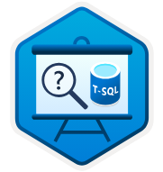

#  Get Started Querying with Transact-SQL

Extracted from <https://learn.microsoft.com/en-us/training/paths/get-started-querying-with-transact-sql/>

5 hr 40 min

Learning Path

6 Modules

Beginner
Data Analyst
Data Engineer
Data Scientist
Database Administrator
Developer
Solution Architect
Student
Technology Manager
Azure SQL Database
SQL Server
Azure SQL Managed Instance
Azure SQL Server on Virtual Machines
SQL Server on Azure Virtual Machines

Learn how to use Transact-SQL to query data in a database.

Prerequisites:  
Familiarity with working with tables of data, for example in a spreadsheet.

