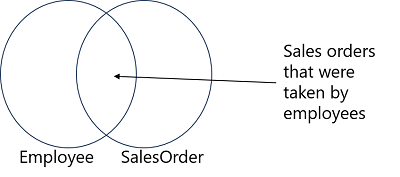
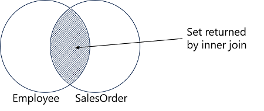

#  Kombiner flere tabeller med JOINs i T-SQL

1 time 2 minutter

Modul

9 enheder

Begynder
Dataanalytiker
Dataingeniør
Datascientist
Databaseadministrator
Udvikler
Løsningsarkitekt
Studerende
Teknologichef
Azure SQL Database
SQL Server
Azure SQL Managed Instance
Azure SQL Server på virtuelle maskiner
SQL Server på Azure virtuelle maskiner

Udforsk T-SQL-forespørgsler, der henter data fra flere tabeller med forskellige typer JOIN-operationer.

#### Læringsmål

Efter at have gennemført dette modul vil du kunne:

* Beskrive join-koncepter og syntaks
* Skrive forespørgsler, der bruger indre og ydre joins
* Skrive forespørgsler, der bruger kryds joins
* Skrive forespørgsler, der bruger selv joins
* Forudsætninger
* Før du starter dette modul, bør du have erfaring med at bruge Transact-SQL SELECT-forespørgsler til at hente og filtrere data fra en tabel i en database.

Dette modul er en del af disse læringsspor:
Kom godt i gang med forespørgsler i Transact-SQL

- Introduktion  
3 min

- Forstå joins koncepter og syntaks  
3 min  

- Brug indre joins  
6 min

- Brug ydre joins  
6 min

- Brug kryds joins  
3 min

- Brug selv joins  
3 min

- Øvelse - Forespørg flere tabeller med joins  
30 min

- Videnstest  
5 min 

- Opsummering  
3 min

## Introduktion

3 minutter

Relationelle databaser indeholder normalt flere tabeller, der er forbundet med fælles nøglefelter. Dette normaliserede design minimerer data-dublikering, men betyder også, at du ofte skal skrive forespørgsler for at hente relaterede data fra to eller flere tabeller.

I dette modul vil du lære at:

* Forstå join-koncepter og syntaks
* Skrive forespørgsler, der bruger indre joins
* Skrive forespørgsler, der bruger ydre joins
* Skrive forespørgsler, der bruger kryds joins
* Skrive forespørgsler, der bruger selv-joins

## Forstå join-koncepter og syntaks

100 XP  
3 minutter  

Den mest grundlæggende og almindelige metode til at kombinere data fra flere tabeller er at bruge en JOIN-operation. Nogle betragter JOIN som en separat klausul i en SELECT-sætning, mens andre ser det som en del af FROM-klausulen. Dette modul vil primært betragte det som en del af FROM-klausulen. I dette modul vil vi opdage, hvordan FROM-klausulen i en T-SQL SELECT-sætning skaber mellemliggende virtuelle tabeller, der vil blive brugt af senere faser af forespørgslen.

### FROM-klausulen og virtuelle tabeller
Hvis du har lært om den logiske rækkefølge af operationer, der udføres, når SQL Server behandler en forespørgsel, har du set, at FROM-klausulen i en SELECT-sætning er den første klausul, der behandles. Denne klausul bestemmer, hvilken tabel eller tabeller der vil være kilden til rækker til forespørgslen. FROM kan referere til en enkelt tabel eller samle flere tabeller som kilden til data for din forespørgsel. Du kan tænke på FROM-klausulen som skabende og udfyldende en virtuel tabel. Denne virtuelle tabel vil holde outputtet af FROM-klausulen og blive brugt af klausulerne i SELECT-sætningen, der anvendes senere, såsom WHERE-klausulen. Når du tilføjer ekstra funktionalitet, såsom join-operatører, til en FROM-klausul, vil det være nyttigt at tænke på formålet med FROM-klausulelementerne som enten at tilføje rækker til eller fjerne rækker fra den virtuelle tabel.

Den virtuelle tabel, der oprettes af en FROM-klausul, er kun en logisk enhed. I SQL Server oprettes der ingen fysisk tabel, hverken vedvarende eller midlertidig, til at holde resultaterne af FROM-klausulen, da den overføres til WHERE-klausulen eller andre dele af forespørgslen.

Den virtuelle tabel, der oprettes af FROM-klausulen, indeholder data fra alle de tilsluttede tabeller. Det kan være nyttigt at tænke på resultaterne som mængder og forestille sig join-resultaterne som et Venn-diagram.



Et Venn-diagram, der viser mængden af en Employee-tabel, der er sammenføjet med en SalesOrder-tabel

Gennem sin historie har T-SQL-sproget udvidet sig for at afspejle ændringer i American National Standards Institute (ANSI) standarder for SQL-sproget. Et af de mest bemærkelsesværdige steder, hvor disse ændringer er synlige, er i syntaksen for joins i en FROM-klausul. I ANSI SQL-89-standarden blev joins specificeret ved at inkludere flere tabeller i FROM-klausulen i en kommasepareret liste. Eventuel filtrering for at bestemme, hvilke rækker der skulle inkluderes, blev udført i WHERE-klausulen, som dette:

```SQL
SELECT p.ProductID, m.Name AS Model, p.Name AS Product
FROM SalesLT.Product AS p, SalesLT.ProductModel AS m
WHERE p.ProductModelID = m.ProductModelID;
```

Denne syntaks understøttes stadig af SQL Server, men på grund af kompleksiteten ved at repræsentere filtrene for komplekse joins anbefales det ikke. Desuden, hvis en WHERE-klausul ved et uheld udelades, kan ANSI SQL-89-stil joins nemt blive til kartesiske produkter og returnere et stort antal resultat-rækker, hvilket kan forårsage præstationsproblemer og muligvis forkerte resultater.

Når du lærer om at skrive multi-table forespørgsler i T-SQL, er det vigtigt at forstå konceptet om kartesiske produkter. I matematik er et kartesisk produkt produktet af to mængder. Produktet af en mængde på to elementer og en mængde på seks elementer er en mængde på 12 elementer, eller 6 x 2. Hvert element i en mængde kombineres med hvert element i den anden mængde. I eksemplet nedenfor har vi en mængde af navne med to elementer og en mængde af produkter med tre elementer. Det kartesiske produkt kombinerer hvert navn med hvert produkt, hvilket giver seks elementer.


I databaser er et kartesisk produkt resultatet af at kombinere hver række i en tabel med hver række i en anden tabel. Produktet af en tabel med 10 rækker og en tabel med 100 rækker er et resultatset med 1.000 rækker. Det underliggende resultat af en JOIN-operation er et kartesisk produkt, men for de fleste T-SQL-forespørgsler er et kartesisk produkt ikke det ønskede resultat. I T-SQL opstår et kartesisk produkt, når to inputtabeller sammenføjes uden at tage hensyn til nogen relationer mellem dem. Uden oplysninger om relationer vil SQL Server forespørgselsprocessoren returnere alle mulige kombinationer af rækker. Mens dette resultat kan have nogle praktiske anvendelser, såsom at generere testdata, er det typisk ikke nyttigt og kan have alvorlige præstationsimplikationer.

Med fremkomsten af ANSI SQL-92-standarden blev der tilføjet understøttelse for nøgleordene JOIN og ON klausuler. T-SQL understøtter også denne syntaks. Joins repræsenteres i FROM-klausulen ved at bruge den relevante JOIN-operatør. Den logiske relation mellem tabellerne, som bliver et filterprædikat, specificeres i ON-klausulen.

Det følgende eksempel gentager den tidligere forespørgsel med den nyere syntaks:

```SQL
SELECT p.ProductID, m.Name AS Model, p.Name AS Product
FROM SalesLT.Product AS p
JOIN SalesLT.ProductModel AS m
    ON p.ProductModelID = m.ProductModelID;
```

> __Bemærk__:  
ANSI SQL-92 syntaksen gør det sværere at skabe utilsigtede kartesiske produkter. Når først nøgleordet JOIN er tilføjet, vil en syntaksfejl blive rejst, hvis en ON-klausul mangler, medmindre JOIN er specificeret som en CROSS JOIN.

## Brug indre joins

Den mest hyppige type JOIN i T-SQL-forespørgsler er INNER JOIN. Indre joins bruges til at løse mange almindelige forretningsproblemer, især i meget normaliserede databasmiljøer. For at hente data, der er gemt på tværs af flere tabeller, vil du ofte have brug for at kombinere dem via INNER JOIN-

forespørgsler. En INNER JOIN begynder sin logiske behandlingsfase som et kartesisk produkt, der derefter filtreres for at fjerne eventuelle rækker, der ikke matcher prædikatet.

### Udførsel af en INNER JOIN
Lad os undersøge de trin, hvormed SQL Server logisk behandler en JOIN-forespørgsel. Linjenumre i følgende hypotetiske eksempel er tilføjet for klarhed:

```SQL
1) SELECT emp.FirstName, ord.Amount
2) FROM HR.Employee AS emp 
3) JOIN Sales.SalesOrder AS ord
4)      ON emp.EmployeeID = ord.EmployeeID;
```

Som du bør være klar over, vil `FROM`-klausulen blive behandlet før `SELECT`-klausulen. Lad os spore behandlingen, begyndende med linje 2:

* FROM-klausulen specificerer `HR.Employee`-tabellen som en af inputtabellerne og giver den aliaset `emp`.
* JOIN-operatøren i linje 3 viser brugen af en INNER JOIN (standardtypen i T-SQL) og specificerer `Sales.SalesOrder` som den anden inputtabel, som har aliaset ord.
* SQL Server vil udføre en logisk kartesisk join på disse tabeller og videregive resultaterne som en virtuel tabel til det næste trin. (Den fysiske behandling af forespørgslen vil muligvis ikke faktisk udføre kartesiske produktoperation, afhængigt af optimererens beslutninger. Men det kan være nyttigt at forestille sig, at det kartesiske produkt bliver skabt.)
* Ved brug af ON-klausulen vil SQL Server filtrere den virtuelle tabel og kun beholde de rækker, hvor en `EmployeeID`-værdi fra `emp`-tabellen matcher en `EmployeeID` i ord-tabellen.
* De resterende rækker er tilbage i den virtuelle tabel og sendes videre til det næste trin i SELECT-sætningen. I dette eksempel behandles den virtuelle tabel næste gang af SELECT-klausulen, og de to specificerede kolonner returneres til klientapplikationen.

Resultatet af den fuldførte forespørgsel er en liste over medarbejdere og deres ordrebeløb. Medarbejdere, der ikke har nogen tilknyttede ordrer, er blevet filtreret ud af ON-klausulen, ligesom eventuelle ordrer, der tilfældigvis har en `EmployeeID`, der ikke svarer til en post i `HR.Employee`-tabellen.


### INNER JOIN syntaks

En INNER JOIN er standardtypen af JOIN, og det valgfrie INNER nøgleord er implicit i JOIN-klausulen. Når du blander og matcher join-typer, kan det være nyttigt at specificere join-typen eksplicit, som vist i dette hypotetiske eksempel:

```SQL
SELECT emp.FirstName, ord.Amount
FROM HR.Employee AS emp 
INNER JOIN Sales.SalesOrder AS ord
    ON emp.EmployeeID = ord.EmployeeID;
```

Når du skriver forespørgsler ved hjælp af indre joins, skal du overveje følgende retningslinjer:

* Tabelaliaser foretrækkes, ikke kun for SELECT-listen, men også til at skrive ON-klausulen.
* Indre joins kan udføres på en enkelt matchende kolonne, såsom en `OrderID`, eller på flere matchende attributter, såsom kombinationen af `OrderID` og `ProductID`. Joins, der specificerer flere matchende kolonner, kaldes sammensatte joins.
* Den rækkefølge, hvori tabeller er angivet i FROM-klausulen for en INNER JOIN, er ikke vigtig for SQL Server-optimereren. Konceptuelt vil joins blive evalueret fra venstre mod højre.
* Brug JOIN-nøgleordet én gang for hvert par af sammenføjede tabeller i FROM-listen. For en to-tabel-forespørgsel angives én join. For en tre-tabel-forespørgsel vil du bruge JOIN to gange; én gang mellem de første to tabeller og igen mellem outputtet af JOIN mellem de første to tabeller og den tredje tabel.

### INNER JOIN eksempler

Det følgende hypotetiske eksempel udfører en join på en enkelt matchende kolonne, der relaterer `ProductModelID` i `Production.Product`-tabellen til `ProductModelID` i `Production.ProductModel`-tabellen:

```SQL
SELECT p.ProductID, m.Name AS Model, p.Name AS Product
FROM Production.Product AS p
INNER JOIN Production.ProductModel AS m
    ON p.ProductModelID = m.ProductModelID
ORDER BY p.ProductID;
```

Dette næste eksempel viser, hvordan en indre join kan udvides til at omfatte mere end to tabeller. `Sales.SalesOrderDetail`-tabellen sammenføjes til outputtet af JOIN mellem Production.Product og `Production.ProductModel`. Hver instans af JOIN/ON udfører sin egen befolkning og filtrering af den virtuelle outputtabel. SQL Server-forespørgselsoptimereren bestemmer, i hvilken rækkefølge joinene og filtreringen vil blive udført.

```SQL
SELECT od.SalesOrderID, m.Name AS Model, p.Name AS ProductName, od.OrderQty
FROM Production.Product AS p
INNER JOIN Production.ProductModel AS m
    ON p.ProductModelID = m.ProductModelID
INNER JOIN Sales.SalesOrderDetail AS od
    ON p.ProductID = od.ProductID
ORDER BY od.SalesOrderID;
```

## Brug ydre joins

100 XP  
6 minutter

Selvom de ikke er så almindelige som indre joins, kan brugen af ydre joins i en multi-table forespørgsel give et alternativt syn på dine forretningsdata. Som med indre joins vil du udtrykke en logisk relation mellem tabellerne. Du vil dog hente ikke kun rækker med matchende attributter, men også alle rækker, der er til stede i en eller begge tabeller, uanset om der er et match i den anden tabel eller ej.

Tidligere lærte du, hvordan du bruger en INNER JOIN til at finde matchende rækker mellem to tabeller. Som du så, bygger forespørgselsprocessoren resultaterne af en INNER JOIN-forespørgsel ved at filtrere rækker ud, der ikke opfylder betingelserne udtrykt i ON-klausulprædikatet. Resultatet er, at kun rækker med en matchende række i den anden tabel returneres. Med en OUTER JOIN kan du vælge at vise alle rækker, der har matchende rækker mellem tabellerne, plus alle rækker, der ikke har et match i den anden tabel. Lad os se på et eksempel og derefter udforske processen.

Først, undersøg følgende forespørgsel, skrevet med en INNER JOIN:

```SQL
SELECT emp.FirstName, ord.Amount
FROM HR.Employee AS emp
INNER JOIN Sales.SalesOrder AS ord
    ON emp.EmployeeID = ord.EmployeeID;
```

Disse rækker repræsenterer et match mellem HR.Employee og Sales.SalesOrder. Kun de EmployeeID-værdier, der er i begge tabeller, vil blive vist i resultaterne.



Nu, lad os undersøge følgende forespørgsel, skrevet som LEFT OUTER JOIN:

```SQL
SELECT emp.FirstName, ord.Amount
FROM HR.Employee AS emp
LEFT OUTER JOIN Sales.SalesOrder AS ord
    ON emp.EmployeeID = ord.EmployeeID;
```

Dette eksempel bruger en LEFT OUTER JOIN-operatør, der styrer forespørgselsprocessoren til at bevare alle rækker fra tabellen til venstre (HR.Employee) og viser Amount-værdierne for matchende rækker i Sales.SalesOrder. Dog returneres alle medarbejdere, uanset om de har taget en salgsordre eller ej. I stedet for Amount-værdien vil forespørgslen returnere NULL for medarbejdere uden matchende salgsordrer.


### OUTER JOIN syntaks
Ydre joins udtrykkes ved hjælp af nøgleordene LEFT, RIGHT eller FULL, der går forud for OUTER JOIN. Formålet med nøgleordet er at angive, hvilken tabel (på hvilken side af nøgleordet JOIN) der skal bevares og have alle sine rækker vist; match eller intet match.

Når du bruger LEFT, RIGHT eller FULL til at definere en join, kan du udelade OUTER nøgleordet, som vist her:

```SQL
SELECT emp.FirstName, ord.Amount
FROM HR.Employee AS emp
LEFT JOIN Sales.SalesOrder AS ord
    ON emp.EmployeeID = ord.EmployeeID;
```

Men ligesom INNER nøgleordet er det ofte nyttigt at skrive kode, der er eksplicit omkring den slags join, der bruges.

Når du skriver forespørgsler ved hjælp af OUTER JOIN, skal du overveje følgende retningslinjer:

* Som du har set, foretrækkes tabelaliaser ikke kun for SELECT-listen, men også for ON-klaus

ulen.
* Ligesom en INNER JOIN kan en OUTER JOIN udføres på en enkelt matchende kolonne eller på flere matchende attributter.
* I modsætning til en INNER JOIN betyder rækkefølgen, hvori tabellerne er opført og tilsluttet i FROM-klausulen, noget ved OUTER JOIN, da det vil bestemme, om du vælger LEFT eller RIGHT til din join.
* Multi-table joins er mere komplekse, når en OUTER JOIN er til stede. Tilstedeværelsen af NULLs i resultaterne af en OUTER JOIN kan forårsage problemer, hvis de mellemliggende resultater derefter sammenføjes til en tredje tabel. Rækker med NULLs kan blive filtreret ud af det andet joins prædikat.
* For kun at vise rækker, hvor der ikke findes noget match, skal du tilføje en test for NULL i en WHERE-klausul efter en OUTER JOIN-prædikat.
* En FULL OUTER JOIN bruges sjældent. Den returnerer alle de matchende rækker mellem de to tabeller, plus alle rækkerne fra den første tabel uden match i den anden, plus alle rækkerne i den anden uden match i den første.
* Der er ingen måde at forudsige rækkefølgen, rækkerne kommer tilbage uden en ORDER BY-klausul. Der er ingen måde at vide, om de matchede eller ikke-matchede rækker vil blive returneret først.

## Brug kryds joins

100 XP  
3 minutter

En kryds join er simpelthen et kartesisk produkt af de to tabeller. Ved hjælp af ANSI SQL-89 syntaks kan du oprette en kryds join ved blot at udelade filteret, der forbinder de to tabeller. Ved hjælp af ANSI-92 syntaks er det lidt sværere; hvilket er godt, fordi en kryds join generelt ikke er noget, du normalt ønsker. Med ANSI-92 syntaks er det meget usandsynligt, at du ender med en kryds join ved et uheld.

For eksplicit at oprette et kartesisk produkt bruger du CROSS JOIN-operatøren.

Denne operation skaber et resultatset med alle mulige kombinationer af inputrækker:

```SQL
SELECT <select_list>
FROM table1 AS t1
CROSS JOIN table2 AS t2;
```

Selvom dette resultat typisk ikke er et ønsket output, er der nogle få praktiske anvendelser til at skrive en eksplicit CROSS JOIN:

* Oprettelse af en tabel med tal, med en række for hver mulig værdi i et interval.
* Generering af store mængder data til test. Når den er kryds sammenføjet med sig selv, kan en tabel med så få som 100 rækker let generere 10.000 outputrækker med lidt arbejde fra dig.

#### CROSS JOIN syntaks
Når du skriver forespørgsler med CROSS JOIN, skal du overveje følgende retningslinjer:

* Der udføres ingen matching af rækker, og derfor bruges ingen ON-klausul. (Det er en fejl at bruge en ON-klausul med CROSS JOIN.)
* For at bruge ANSI SQL-92 syntaks skal du adskille inputtabelnavnene med CROSS JOIN-operatøren.

Den følgende forespørgsel er et eksempel på brug af CROSS JOIN til at oprette alle kombinationer af medarbejdere og produkter:

```SQL
SELECT emp.FirstName, prd.Name
FROM HR.Employee AS emp
CROSS JOIN Production.Product AS prd;
```

## Brug selv joins

100 XP  
3 minutter

Indtil nu har de joins, vi har brugt, involveret forskellige tabeller. Der kan være scenarier, hvor du skal hente og sammenligne rækker fra en tabel med andre rækker fra samme tabel. For eksempel i en personalestyringsapplikation kan en Employee-tabel indeholde oplysninger om hver medarbejders leder og gemme lederens ID i medarbejderens egen række. Hver leder er også angivet som en medarbejder.

|EmployeeID |FirstName | ManagerID|
|:-|:-|:-|
|1 |Dan |NULL |
|2 |Aisha|1
3|Rosie|1
4|Naomi|3

For at hente medarbejderoplysningerne og matche dem til den relaterede leder kan du bruge tabellen to gange i din forespørgsel, hvor du sammenføjer den med sig selv med henblik på forespørgslen.

```SQL
SELECT emp.FirstName AS Employee, 
       mgr.FirstName AS Manager
FROM HR.Employee AS emp
LEFT OUTER JOIN HR.Employee AS mgr
  ON emp.ManagerID = mgr.EmployeeID;
```

Resultaterne af denne forespørgsel inkluderer en række for hver medarbejder med navnet på deres leder. Virksomhedens CEO har ingen leder. For at inkludere CEO'en i resultaterne bruges en outer join, og ledernavnet returneres som NULL for rækker, hvor ManagerID-feltet ikke har noget matchende EmployeeID-felt.

|Employee|Manager|
|:-|:-|
|Dan|NULL|
|Aisha|Dan|
|Rosie|Dan|
|Naomi|Rosie|

Der er andre scenarier, hvor du vil sammenligne rækker i en tabel med forskellige rækker i samme tabel. Som du har set, er det ret nemt at sammenligne kolonner i samme række ved hjælp af T-SQL, men metoden til at sammenligne værdier fra forskellige rækker (såsom en række, der gemmer en starttid, og en anden række i samme tabel, der gemmer en tilsvarende stop tid) er mindre åbenlyst. Selv-joins er en nyttig teknik til denne type forespørgsler.

For at udføre opgaver som denne bør du overveje følgende retningslinjer:

* Definer to forekomster af den samme tabel i FROM-klausulen, og tilslut dem efter behov ved hjælp af indre eller ydre joins.
* Brug tabelaliaser til at skelne mellem de to forekomster af den samme tabel.
* Brug ON-klausulen til at give et filter, der sammenligner kolonner fra én forekomst af tabellen med kolonner fra den anden forekomst af tabellen.

## Øvelse - Forespørg flere tabeller med joins

100 XP  
30 minutter

Denne enhed indeholder et laboratorium, der skal gennemføres.

Brug de gratis ressourcer, der leveres i laboratoriet, til at gennemføre øvelserne i denne enhed. Du vil ikke blive opkrævet for laboratoriemiljøet; dog kan du muligvis have brug for dit eget abonnement afhængigt af laboratoriet.

Microsoft leverer denne lab-oplevelse og relateret indhold til uddannelsesmæssige formål. Alle præsenterede oplysninger ejes af Microsoft og er udelukkende beregnet til at lære om de dækkede produkter og tjenester i dette Microsoft Learn-modul.

Bemærk:

> En virtuel maskine, der indeholder de klientværktøjer, du har brug for, leveres sammen med øvelsesinstruktionerne. Brug knappen ovenfor til at starte den virtuelle maskine. Et begrænset antal samtidige sessioner er tilgængelige - hvis det hostede miljø ikke er tilgængeligt, så prøv igen senere. Alternativt kan du bruge disse opsætningsinstruktioner til at oprette dit eget laboratoriemiljø og følge disse øvelsesinstruktioner.

Når du er færdig med øvelsen, skal du afslutte laboratoriet for at lukke VM'en. Glem ikke at vende tilbage og gennemføre vidensprøven for at optjene point for at gennemføre dette modul!