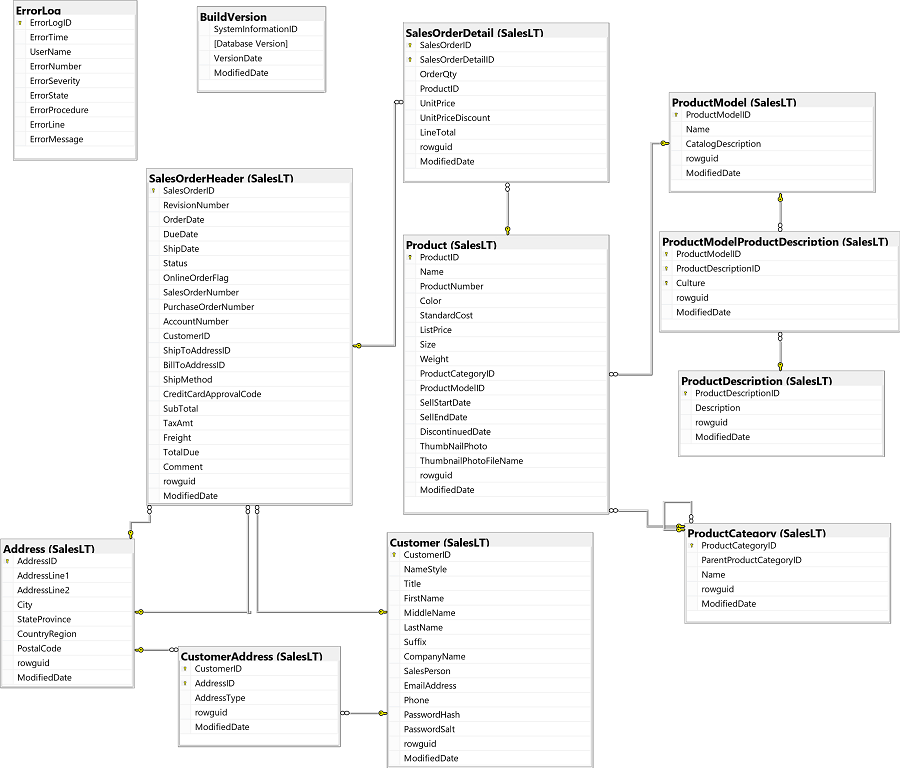

# Forespørg flere tabeller med Joins 

I denne øvelse vil du bruge Transact-SQL `SELECT`-sætningen til at forespørge flere tabeller i `adventureworks`-databasen. Til din reference viser det følgende diagram tabellerne i databasen (du skal muligvis ændre størrelsen på panelet for at se dem tydeligt).



> **Bemærk**: Hvis du er bekendt med standard `AdventureWorks` eksempeldatabasen, vil du måske bemærke, at vi i denne øvelse bruger en forenklet version, der gør det lettere at fokusere på at lære Transact-SQL-syntaksen.

## Brug af indre joins
En indre join bruges til at finde relaterede data i to tabeller. For eksempel, antag at du skal hente data om et produkt og dets kategori fra tabellerne `SalesLT.Product` og `SalesLT.ProductCategory`. Du kan finde den relevante produktkategori for et produkt baseret på dets `ProductCategoryID`-felt, som er en fremmednøgle i produkttabellen, der matcher en primær nøgle i produktkategoritabellen.

1. Start Azure Data Studio, og opret en ny forespørgsel (du kan gøre dette fra __Filer__-menuen eller på velkomstsiden).
2. I den nye __SQLQuery_…__ rude skal du bruge __Forbind__-knappen til at forbinde forespørgslen til den gemte __AdventureWorks__ forbindelse.
3. Indtast følgende kode i forespørgselseditoren:

```SQL
 SELECT SalesLT.Product.Name AS ProductName, SalesLT.ProductCategory.Name AS Category
 FROM SalesLT.Product
 INNER JOIN SalesLT.ProductCategory
 ON SalesLT.Product.ProductCategoryID = SalesLT.ProductCategory.ProductCategoryID;
```

4. Brug __|>Kør__-knappen til at køre forespørgslen, og efter et par sekunder gennemgå resultaterne, som inkluderer `ProductName` fra produkttabellen og den tilsvarende `Category` fra produktkategoritabellen. Fordi forespørgslen bruger en `INNER` join, udelades produkter, der ikke har tilsvarende kategorier, og kategorier, der ikke indeholder produkter, fra resultaterne.

5. Modificer forespørgslen som følger for at fjerne `INNER` nøgleordet og kør den igen.

```SQL
 SELECT SalesLT.Product.Name AS ProductName, SalesLT.ProductCategory.Name AS Category
 FROM SalesLT.Product
 JOIN SalesLT.ProductCategory
     ON SalesLT.Product.ProductCategoryID = SalesLT.ProductCategory.ProductCategoryID;
```

Resultaterne bør være de samme som før. `INNER` joins er standardtypen af join.

6. Ændr forespørgslen for at tildele aliaser til tabellerne i `JOIN`-klausulen, som vist her:

```SQL
 SELECT p.Name AS ProductName, c.Name AS Category
 FROM SalesLT.Product AS p
 JOIN SalesLT.ProductCategory AS c
     ON p.ProductCategoryID = c.ProductCategoryID;
```

7. Kør den ændrede forespørgsel og bekræft, at den returnerer de samme resultater som før. Brugen af tabelaliaser kan forenkle en forespørgsel betydeligt, især når flere joins skal bruges.

8. Erstat forespørgslen med følgende kode, som henter salgsordredata fra tabellerne `SalesLT.SalesOrderHeader`, `SalesLT.SalesOrderDetail`, og `SalesLT.Product`:

```SQL
 SELECT oh.OrderDate, oh.SalesOrderNumber, p.Name AS ProductName, od.OrderQty, od.UnitPrice, od.LineTotal
 FROM SalesLT.SalesOrderHeader AS oh
 JOIN SalesLT.SalesOrderDetail AS od
     ON od.SalesOrderID = oh.SalesOrderID
 JOIN SalesLT.Product AS p
     ON od.ProductID = p.ProductID
 ORDER BY oh.OrderDate, oh.SalesOrderID, od.SalesOrderDetailID;
```

9. Kør den ændrede forespørgsel og bemærk, at den returnerer data fra alle tre tabeller.

## Brug af ydre joins

En ydre join bruges til at hente alle rækker fra en tabel og eventuelle tilsvarende rækker fra en relateret tabel. I tilfælde, hvor en række i den ydre tabel ikke har nogen tilsvarende rækker i den relaterede tabel, returneres NULL-værdier for de relaterede tabelfelter. For eksempel, antag at du vil hente en liste over alle kunder og eventuelle ordrer, de har afgivet, inklusive kunder, der har registreret sig, men aldrig afgivet en ordre.

1. Erstat den eksisterende forespørgsel med følgende kode:

```SQL
 SELECT c.FirstName, c.LastName, oh.SalesOrderNumber
 FROM SalesLT.Customer AS c
 LEFT OUTER JOIN SalesLT.SalesOrderHeader AS oh
     ON c.CustomerID = oh.CustomerID
 ORDER BY c.CustomerID;
```

2. Kør forespørgslen og bemærk, at resultaterne indeholder data for hver kunde. Hvis en kunde har afgivet en ordre, vises ordrenummeret. Kunder, der har registreret sig, men ikke afgivet en ordre, vises med et NULL ordrenummer.

> **Bemærk** brugen af nøgleordet `LEFT`. Dette identificerer, hvilken af tabellerne i joinet der er den ydre tabel (den, hvorfra alle rækker skal bevares). I dette tilfælde er joinet mellem tabellerne `Customer` og `SalesOrderHeader`, så en `LEFT` join betegner `Customer` som den ydre tabel. Havde der været brugt en `RIGHT` join, ville forespørgslen have returneret alle poster fra tabellen `SalesOrderHeader` og kun matchende data fra tabellen `Customer` (med andre ord, alle ordrer, inklusive dem, hvor der ikke var nogen matchende kundeoptegnelse). Du kan også bruge en `FULL` ydre join til at bevare umatchede rækker fra _begge_ sider af joinet (alle kunder, inklusive dem, der ikke har afgivet en ordre; og alle ordrer, inklusive dem uden matchende kunde), selvom dette i praksis bruges sjældnere.

3. Modificer forespørgslen for at fjerne nøgleordet `OUTER`, som vist her:

```SQL
 SELECT c.FirstName, c.LastName, oh.SalesOrderNumber
 FROM SalesLT.Customer AS c
 LEFT JOIN SalesLT.SalesOrderHeader AS oh
     ON c.CustomerID = oh.CustomerID
 ORDER BY c.CustomerID;
```

4. Kør forespørgslen og gennemgå resultaterne, som burde være de samme som før. Brug af nøgleordet `LEFT` (eller `RIGHT`) identificerer automatisk joinet som en `OUTER` join.

5. Modificer forespørgslen som vist nedenfor for at drage fordel af, at den identificerer ikke-matchende rækker og kun returnerer de kunder, der ikke har afgivet nogen ordrer.

```SQL
 SELECT c.FirstName, c.LastName, oh.SalesOrderNumber
 FROM SalesLT.Customer AS c
 LEFT JOIN SalesLT.SalesOrderHeader AS oh
     ON c.CustomerID = oh.CustomerID
 WHERE oh.SalesOrderNumber IS NULL 
 ORDER BY c.CustomerID;
```

6. Kør forespørgslen og gennemgå resultaterne, som indeholder data for kunder, der ikke har afgivet nogen ordrer.

7. Erstat forespørgslen med den følgende, som bruger ydre joins til at hente data fra tre tabeller.

```SQL
 SELECT p.Name As ProductName, oh.SalesOrderNumber
 FROM SalesLT.Product AS p
 LEFT JOIN SalesLT.SalesOrderDetail AS od
     ON p.ProductID = od.ProductID
 LEFT JOIN SalesLT.SalesOrderHeader AS oh
     ON od.SalesOrderID = oh.SalesOrderID
 ORDER BY p.ProductID;
```

8. Kør forespørgslen og bemærk, at resultaterne inkluderer alle produkter med ordrenumre for dem, der er blevet købt. Dette krævede en sekvens af joins fra `Product` til `SalesOrderDetail` til `SalesOrderHeader`. Bemærk, at når du sammenføjer flere tabeller som dette, skal alle efterfølgende ydre joins efter en ydre join i rækkefølgen være af samme retning (`LEFT` eller `RIGHT`).

9. Modificer forespørgslen som vist nedenfor for at tilføje en indre join for at returnere kategoridata. Når man blander indre og ydre joins, kan det være nyttigt at være eksplicit om join-typerne ved at bruge nøgleordene `INNER` og `OUTER`.

```SQL
 SELECT p.Name As ProductName, c.Name AS Category, oh.SalesOrderNumber
 FROM SalesLT.Product AS p
 LEFT OUTER JOIN SalesLT.SalesOrderDetail AS od
     ON p.ProductID = od.ProductID


 LEFT OUTER JOIN SalesLT.SalesOrderHeader AS oh
     ON od.SalesOrderID = oh.SalesOrderID
 INNER JOIN SalesLT.ProductCategory AS c
     ON p.ProductCategoryID = c.ProductCategoryID
 ORDER BY p.ProductID;
```

10. Kør forespørgslen og gennemgå resultaterne, som inkluderer produktnavne, kategorier og salgsordrenumre.

## Brug af kryds joins

En kryds join matcher alle mulige kombinationer af rækker fra de tabeller, der bliver sammenføjet. I praksis bruges den sjældent, men der er nogle specialiserede tilfælde, hvor den er nyttig.

1. Erstat den eksisterende forespørgsel med følgende kode:

```SQL
 SELECT p.Name, c.FirstName, c.LastName, c.EmailAddress
 FROM SalesLT.Product AS p
 CROSS JOIN SalesLT.Customer AS c;
```

2. Kør forespørgslen og bemærk, at resultaterne indeholder en række for hver kombination af produkt og kunde (som måske kunne bruges til at skabe en markedsføringskampagne, hvor en individuel annonce for hvert produkt sendes til hver kunde - en strategi, der muligvis ikke gør virksomheden populær hos sine kunder!).

## Brug af selv joins

En _selv_ join er faktisk ikke en specifik slags join, men det er en teknik, der bruges til at sammenføje en tabel med sig selv ved at definere to forekomster af tabellen, hver med sit eget alias. Denne tilgang kan være nyttig, når en række i tabellen inkluderer et fremmednøglefelt, der refererer til primærnøglen i den samme tabel; for eksempel i en tabel over medarbejdere, hvor en medarbejders leder også er en medarbejder, eller en tabel over produktkategorier, hvor hver kategori kan være en underkategori af en anden kategori.

1. Erstat den eksisterende forespørgsel med følgende kode, som inkluderer en selv join mellem to forekomster af `SalesLT.ProductCategory` tabellen (med aliaserne `cat` og `pcat`):

```SQL
 SELECT pcat.Name AS ParentCategory, cat.Name AS SubCategory
 FROM SalesLT.ProductCategory AS cat
 JOIN SalesLT.ProductCategory pcat
     ON cat.ParentProductCategoryID = pcat.ProductCategoryID
 ORDER BY ParentCategory, SubCategory;
```

Kør forespørgslen og gennemgå resultaterne, som afspejler hierarkiet af over- og underkategorier.

## Udfordringer
Nu hvor du har set nogle eksempler på joins, er det din tur til at prøve at hente data fra flere tabeller selv.

> Tip: Prøv at finde de passende forespørgsler selv. Hvis du går i stå, er der forslag til svar i slutningen af denne øvelse.

### Udfordring 1: Generer fakturarapporter
Adventure Works Cycles sælger direkte til detailhandlere, som skal faktureres for deres ordrer. Du har fået til opgave at skrive en forespørgsel for at generere en liste over fakturaer, der skal sendes til kunder.

1. Hent kundeordrer
   Som et første skridt mod at generere fakturarapporten skal du skrive en forespørgsel, der returnerer firmanavnet fra tabellen SalesLT.Customer og salgsordre-ID'et og det samlede skyldige beløb fra tabellen SalesLT.SalesOrderHeader.
   
2. Hent kundeordrer med adresser
   Udvid din forespørgsel om kundeordrer til at inkludere hovedkontoradressen for hver kunde, inklusive den fulde gadeadresse, by, stat eller provins, postnummer og land eller region.

   > Tip: Bemærk, at hver kunde kan have flere adresser i tabellen SalesLT.Address, så databaseudvikleren har oprettet tabellen SalesLT.CustomerAddress for at muliggøre et mange-til-mange forhold mellem kunder og adresser. Din forespørgsel skal inkludere begge disse tabeller og bør filtrere resultaterne, så kun hovedkontoradresser er inkluderet.

### Udfordring 2: Hent kundedata
Når du fortsætter med at arbejde med Adventure Works kunde- og salgsdata, skal du oprette forespørgsler til rapporter, der er blevet anmodet om af salgsteamet.

1. Hent en liste over alle kunder og deres ordrer
   * Salgschefen ønsker en liste over alle kundeselskaber og deres kontakter (fornavn og efternavn), der viser salgsordre-ID'et og det samlede skyldige beløb for hver ordre, de har afgivet. Kunder, der ikke har afgivet nogen ordrer, skal inkluderes nederst på listen med NULL-værdier for ordre-ID og det samlede skyldige beløb.

2. Hent en liste over kunder uden adresse
   * En salgskonsulent har bemærket, at Adventure Works ikke har adresseoplysninger for alle kunder. Du skal skrive en forespørgsel, der returnerer en liste over kunde-ID'er, firmanavne, kontaktnavne (fornavn og efternavn) og telefonnumre for kunder uden adresse gemt i databasen.

### Udfordring 3: Opret en produktkatalog
Marketingteamet har bedt dig om at hente data til et nyt produktkatalog.

1. Hent produktinformation efter kategori
   * Produktkataloget vil liste produkter efter hovedkategori og underkategori, så du skal skrive en forespørgsel, der henter felterne for hovedkategorinavn, underkategorinavn og produktnavn til kataloget.

---
__SPOILER ALERT__

## Løsninger til udfordringer
Dette afsnit indeholder foreslåede løsninger til udfordringsforespørgslerne.

### Udfordring 1

1. Hent kundeordrer:

```SQL
 SELECT c.CompanyName, oh.SalesOrderID, oh.TotalDue
 FROM SalesLT.Customer AS c
 JOIN SalesLT.SalesOrderHeader AS oh
     ON oh.CustomerID = c.CustomerID;
```

2. Hent kundeordrer med adresser:

```SQL
 SELECT c.CompanyName,
        a.AddressLine1,
        ISNULL(a.AddressLine2, '') AS AddressLine2,
        a.City,
        a.StateProvince,
        a.PostalCode,
        a.CountryRegion,
        oh.SalesOrderID,
        oh.TotalDue
 FROM SalesLT.Customer AS c
 JOIN SalesLT.SalesOrderHeader AS oh
     ON oh.CustomerID = c.CustomerID
 JOIN SalesLT.CustomerAddress AS ca
     ON c.CustomerID = ca.CustomerID
 JOIN SalesLT.Address AS a
     ON ca.AddressID = a.AddressID
 WHERE ca.AddressType = 'Main Office';
```

### Udfordring 2

1. Hent en liste over alle kunder og deres ordrer:

```SQL
 SELECT c.CompanyName, c.FirstName, c.LastName,
        oh.SalesOrderID, oh.TotalDue
 FROM SalesLT.Customer AS c
 LEFT JOIN SalesLT.SalesOrderHeader AS oh
     ON c.CustomerID = oh.CustomerID
 ORDER BY oh.SalesOrderID DESC;
```

2. Hent en liste over kunder uden adresse:

```SQL
 SELECT c.CompanyName, c.FirstName, c.LastName, c.Phone
 FROM SalesLT.Customer AS c
 LEFT JOIN SalesLT.CustomerAddress AS ca
     ON c.CustomerID = ca.CustomerID
 WHERE ca.AddressID IS NULL;
```

### Udfordring 3

1. Hent produktinformation efter kategori:

```SQL
 SELECT pcat.Name AS ParentCategory, cat.Name AS SubCategory, prd.Name AS ProductName
 FROM SalesLT.ProductCategory pcat
 JOIN SalesLT.ProductCategory AS cat
     ON pcat.ProductCategoryID = cat.ParentProductCategoryID
 JOIN SalesLT.Product AS prd
     ON prd.ProductCategoryID = cat.ProductCategoryID
 ORDER BY ParentCategory, SubCategory, ProductName;
```

Hvis du har flere spørgsmål eller har brug for yderligere hjælp, så lad mig det vide!