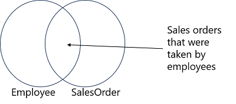
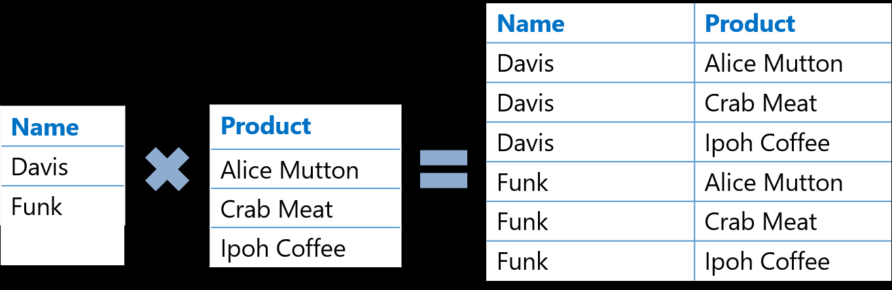
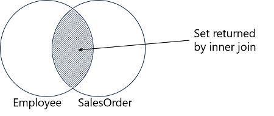
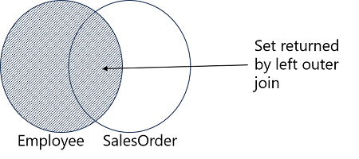

#  Combine multiple tables with JOINs in T-SQL

1 hr 2 min

Module

9 Units

Beginner
Data Analyst
Data Engineer
Data Scientist
Database Administrator
Developer
Solution Architect
Student
Technology Manager
Azure SQL Database
SQL Server
Azure SQL Managed Instance
Azure SQL Server on Virtual Machines
SQL Server on Azure Virtual Machines

Explore T-SQL queries accessing data from multiple tables with various kinds of JOIN operations.

#### Learning objectives

After completing this module, you will be able to:

* Describe join concepts and syntax
* Write queries that use inner and outer joins
* Write queries that use cross joins
* Write queries that use self joins
* Prerequisites
* Before starting this module, you should have experience of using Transact-SQL SELECT queries to retrieve and filter data from a table in a database.

This module is part of these learning paths
Get Started Querying with Transact-SQL

- Introduction  
3 min

- Understand joins concepts and syntax  
3 min  

- Use inner joins  
6 min

- Use outer joins  
6 min

- Use cross joins  
3 min

- Use self joins  
3 min

- Exercise - Query multiple tables with joins  
30 min

- Knowledge check  
5 min 

- Summary  
3 min

## Introduction

3 minutes

Relational databases usually contain multiple tables that are linked by common key fields. This normalized design minimizes duplication of data, but means that you'll often need to write queries to retrieve related data from two or more tables.

In this module, you'll learn how to:

* Understand join concepts and syntax
* Write queries that use inner joins
* Write queries that use outer joins
* Write queries that use cross joins
* Write queries that use self-joins

## Understand joins concepts and syntax

100 XP  
3 minutes  

The most fundamental and common method of combining data from multiple tables is to use a JOIN operation. Some people think of JOIN as a separate clause in a SELECT statement, but others think of it as part of the FROM clause. This module will mainly consider it to be part of the FROM clause. In this module, we'll discover how the FROM clause in a T-SQL SELECT statement creates intermediate virtual tables that will be consumed by later phases of the query.

### The FROM Clause and Virtual Tables
If you’ve learned about the logical order of operations that are performed when SQL Server processes a query, you’ve seen that the FROM clause of a SELECT statement is the first clause to be processed. This clause determines which table or tables will be the source of rows for the query. The FROM can reference a single table or bring together multiple tables as the source of data for your query. You can think of the FROM clause as creating and populating a virtual table. This virtual table will hold the output of the FROM clause and be used by clauses of the SELECT statement that are applied later, such as the WHERE clause. As you add extra functionality, such as join operators, to a FROM clause, it will be helpful to think of the purpose of the FROM clause elements as either to add rows to, or remove rows from, the virtual table.

The virtual table created by a FROM clause is a logical entity only. In SQL Server, no physical table is created, whether persistent or temporary, to hold the results of the FROM clause, as it is passed to the WHERE clause or other parts of the query.

The virtual table created by the FROM clause contains data from all of the joined tables. It can be useful to think of the results as sets, and conceptualize the join results as a Venn diagram.



A Venn diagram showing the set of an Employee table joined to a SalesOrder table

Throughout its history, the T-SQL language has expanded to reflect changes to the American National Standards Institute (ANSI) standards for the SQL language. One of the most notable places where these changes are visible is in the syntax for joins in a FROM clause. In the ANSI SQL-89 standard, joins were specified by including multiple tables in the FROM clause in a comma-separated list. Any filtering to determine which rows to include were performed in the WHERE clause, like this:

```SQL
SELECT p.ProductID, m.Name AS Model, p.Name AS Product
FROM SalesLT.Product AS p, SalesLT.ProductModel AS m
WHERE p.ProductModelID = m.ProductModelID;
```

This syntax is still supported by SQL Server, but because of the complexity of representing the filters for complex joins, it is not recommended. Additionally, if a WHERE clause is accidentally omitted, ANSI SQL-89-style joins can easily become Cartesian products and return an excessive number of result rows, causing performance problems, and possibly incorrect results.

When learning about writing multi-table queries in T-SQL, it's important to understand the concept of Cartesian products. In mathematics, a Cartesian product is the product of two sets. The product of a set of two elements and a set of six elements is a set of 12 elements, or 6 x 2. Every element in one set is combined with every element in the other set. In the example below, we have a set of names with two elements and a set of products with three elements. The Cartesian product combines every name with every product yielding six elements.



In databases, a Cartesian product is the result of combining every row in one table to every row of another table. The product of a table with 10 rows and a table with 100 rows is a result set with 1,000 rows. The underlying result of a JOIN operation is a Cartesian product but for most T-SQL queries, a Cartesian product isn't the desired result. In T-SQL, a Cartesian product occurs when two input tables are joined without considering any relationships between them. With no information about relationships, the SQL Server query processor will return all possible combinations of rows. While this result can have some practical applications, such as generating test data, it's not typically useful and can have severe performance implications.

With the advent of the ANSI SQL-92 standard, support for the keywords JOIN and ON clauses was added. T-SQL also supports this syntax. Joins are represented in the FROM clause by using the appropriate JOIN operator. The logical relationship between the tables, which becomes a filter predicate, is specified in the ON clause.

The following example restates the previous query with the newer syntax:

```SQL
SELECT p.ProductID, m.Name AS Model, p.Name AS Product
FROM SalesLT.Product AS p
JOIN SalesLT.ProductModel AS m
    ON p.ProductModelID = m.ProductModelID;
```
Note:

> The ANSI SQL-92 syntax makes it more difficult to create accidental Cartesian products. Once the keyword JOIN has been added, a syntax error will be raised if an ON clause is missing, unless the JOIN is specified as a CROSS JOIN.

## Use inner joins

The most frequent type of JOIN in T-SQL queries is INNER JOIN. Inner joins are used to solve many common business problems, especially in highly normalized database environments. To retrieve data that has been stored across multiple tables, you will often need to combine it via INNER JOIN queries. An INNER JOIN begins its logical processing phase as a Cartesian product, which is then filtered to remove any rows that don't match the predicate.

### Processing an INNER JOIN
Let’s examine the steps by which SQL Server will logically process a JOIN query. Line numbers in the following hypothetical example are added for clarity:

```SQL

1) SELECT emp.FirstName, ord.Amount
2) FROM HR.Employee AS emp 
3) JOIN Sales.SalesOrder AS ord
4)      ON emp.EmployeeID = ord.EmployeeID;
```
As you should be aware, the FROM clause will be processed before the SELECT clause. Let’s track the processing, beginning with line 2:

* The FROM clause specifies the HR.Employee table as one of the input tables, giving it the alias emp.
* The JOIN operator in line 3 reflects the use of an INNER JOIN (the default type in T-SQL) and specifies Sales.SalesOrder as the other input table, which has an alias of ord.
* SQL Server will perform a logical Cartesian join on these tables and pass the results as a virtual table to the next step. (The physical processing of the query may not actually perform the Cartesian product operation, depending on the optimizer's decisions. But it can be helpful to imagine the Cartesian product being created.)
* Using the ON clause, SQL Server will filter the virtual table, keeping only those rows where an EmployeeID value from the emp table matches a EmployeeID in the ord table.
* The remaining rows are left in the virtual table and handed off to the next step in the SELECT statement. In this example, the virtual table is next processed by the SELECT clause, and the two specified columns are returned to the client application.

The result of the completed query is a list of employees and their order amounts. Employees that do not have any associated orders have been filtered out by the ON clause, as have any orders that happen to have a EmployeeID that doesn't correspond to an entry in the HR.Employee table.



### INNER JOIN syntax

An INNER JOIN is the default type of JOIN, and the optional INNER keyword is implicit in the JOIN clause. When mixing and matching join types, it can be useful to specify the join type explicitly, as shown in this hypothetical example:

```SQL
SELECT emp.FirstName, ord.Amount
FROM HR.Employee AS emp 
INNER JOIN Sales.SalesOrder AS ord
    ON emp.EmployeeID = ord.EmployeeID;
```

When writing queries using inner joins, consider the following guidelines:

Table aliases are preferred, not only for the SELECT list, but also for writing the ON clause.

* Inner joins may be performed on a single matching column, such as an OrderID, or on multiple matching attributes, such as the combination of OrderID and ProductID. Joins that specify multiple matching columns are called composite joins.
* The order in which tables are listed in the FROM clause for an INNER JOIN doesn't matter to the SQL Server optimizer. Conceptually, joins will be evaluated from left to right.
* Use the JOIN keyword once for each pair of joined tables in the FROM list. For a two-table query, specify one join. For a three-table query, you'll use JOIN twice; once between the first two tables, and once again between the output of the JOIN between the first two tables and the third table.

### INNER JOIN examples

The following hypothetical example performs a join on a single matching column, relating the ProductModelID in the Production.Product table to the ProductModelID on the Production.ProductModel table:

```SQL
SELECT p.ProductID, m.Name AS Model, p.Name AS Product
FROM Production.Product AS p
INNER JOIN Production.ProductModel AS m
    ON p.ProductModelID = m.ProductModelID
ORDER BY p.ProductID;
```

This next example shows how an inner join may be extended to include more than two tables. The Sales.SalesOrderDetail table is joined to the output of the JOIN between Production.Product and Production.ProductModel. Each instance of JOIN/ON does its own population and filtering of the virtual output table. The SQL Server query optimizer determines the order in which the joins and filtering will be performed.

```SQL
SELECT od.SalesOrderID, m.Name AS Model, p.Name AS ProductName, od.OrderQty
FROM Production.Product AS p
INNER JOIN Production.ProductModel AS m
    ON p.ProductModelID = m.ProductModelID
INNER JOIN Sales.SalesOrderDetail AS od
    ON p.ProductID = od.ProductID
ORDER BY od.SalesOrderID;
```

## Use outer joins

100 XP  
6 minutes

While not as common as inner joins, the use of outer joins in a multi-table query can provide an alternative view of your business data. As with inner joins, you will express a logical relationship between the tables. However, you will retrieve not only rows with matching attributes, but also all rows present in one or both of the tables, whether or not there is a match in the other table.

Previously, you learned how to use an INNER JOIN to find matching rows between two tables. As you saw, the query processor builds the results of an INNER JOIN query by filtering out rows that don't meet the conditions expressed in the ON clause predicate. The result is that only rows with a matching row in the other table are returned. With an OUTER JOIN, you can choose to display all the rows that have matching rows between the tables, plus all the rows that don’t have a match in the other table. Let's look at an example, then explore the process.

First, examine the following query, written with an INNER JOIN:

```SQL
SELECT emp.FirstName, ord.Amount
FROM HR.Employee AS emp
INNER JOIN Sales.SalesOrder AS ord
    ON emp.EmployeeID = ord.EmployeeID;
```

These rows represent a match between HR.Employee and Sales.SalesOrder. Only those EmployeeID values that are in both tables will appear in the results.


Now, let’s examine the following query, written as LEFT OUTER JOIN:

```SQL
SELECT emp.FirstName, ord.Amount
FROM HR.Employee AS emp
LEFT OUTER JOIN Sales.SalesOrder AS ord
    ON emp.EmployeeID = ord.EmployeeID;
```

This example uses a LEFT OUTER JOIN operator, which directs the query processor to preserve all rows from the table on the left (HR.Employee) and displays the Amount values for matching rows in Sales.SalesOrder. However, all employees are returned, whether or not they have taken a sales order. In place of the Amount value, the query will return NULL for employees with no matching sales orders.




### OUTER JOIN syntax
Outer joins are expressed using the keywords LEFT, RIGHT, or FULL preceding OUTER JOIN. The purpose of the keyword is to indicate which table (on which side of the keyword JOIN) should be preserved and have all its rows displayed; match, or no match.

When using LEFT, RIGHT, or FULL to define a join, you can omit the OUTER keyword as shown here:

```SQL
SELECT emp.FirstName, ord.Amount
FROM HR.Employee AS emp
LEFT JOIN Sales.SalesOrder AS ord
    ON emp.EmployeeID = ord.EmployeeID;
```

However, like the INNER keyword, it is often helpful to write code that is explicit about the kind of join being used.

When writing queries using OUTER JOIN, consider the following guidelines:

* As you have seen, table aliases are preferred not only for the SELECT list, but also for the ON clause.
* As with an INNER JOIN, an OUTER JOIN may be performed on a single matching column or on multiple matching attributes.
* Unlike an INNER JOIN, the order in which tables are listed and joined in the FROM clause does matter with OUTER JOIN, as it will determine whether you choose LEFT or RIGHT for your join.
* Multi-table joins are more complex when an OUTER JOIN is present. The presence of NULLs in the results of an OUTER JOIN may cause issues if the intermediate results are then joined to a third table. Rows with NULLs may be filtered out by the second join's predicate.
* To display only rows where no match exists, add a test for NULL in a WHERE clause following an OUTER JOIN predicate.
* A FULL OUTER JOIN is used rarely. It returns all the matching rows between the two tables, plus all the rows from the first table with no match in the second, plus all the rows in the second without a match in the first.
* There is no way to predict the order the rows will come back without an ORDER BY clause. There’s no way to know if the matched or unmatched rows will be returned first.

## Use cross joins

100 XP  
3 minutes

A cross join is simply a Cartesian product of the two tables. Using ANSI SQL-89 syntax, you can create a cross join by just leaving off the filter that connects the two tables. Using the ANSI-92 syntax, it’s a little harder; which is good, because in general, a cross join isn't something that you usually want. With the ANSI-92 syntax, it's highly unlikely you'll end up with a cross join accidentally.

To explicitly create a Cartesian product, you use the CROSS JOIN operator.

This operation creates a result set with all possible combinations of input rows:

```SQL
SELECT <select_list>
FROM table1 AS t1
CROSS JOIN table2 AS t2;
```

While this result isn't typically a desired output, there are a few practical applications for writing an explicit CROSS JOIN:

* Creating a table of numbers, with a row for each possible value in a range.
* Generating large volumes of data for testing. When cross joined to itself, a table with as few as 100 rows can readily generate 10,000 output rows with little work from you.

#### CROSS JOIN syntax
When writing queries with CROSS JOIN, consider the following guidelines:

* There is no matching of rows performed, and so no ON clause is used. (It is an error to use an ON clause with CROSS JOIN.)
* To use ANSI SQL-92 syntax, separate the input table names with the CROSS JOIN operator.

The following query is an example of using CROSS JOIN to create all combinations of employees and products:

```SQL
SELECT emp.FirstName, prd.Name
FROM HR.Employee AS emp
CROSS JOIN Production.Product AS prd;
```

## Use self joins

100 XP  
3 minutes

So far, the joins we've used have involved different tables. There may be scenarios in which you need to retrieve and compare rows from a table with other rows from the same table. For example, in a human resources application, an Employee table might include information about the manager of each employee, and store the manager's ID in the employee's own row. Each manager is also listed as an employee.


|EmployeeID |FirstName | ManagerID|
|:-|:-|:-|
|1 |Dan |NULL |
|2 |Aisha|1
3|Rosie|1
4|Naomi|3

To retrieve the employee information and match it to the related manager, you can use the table twice in your query, joining it to itself for the purposes of the query.

```SQL
SELECT emp.FirstName AS Employee, 
       mgr.FirstName AS Manager
FROM HR.Employee AS emp
LEFT OUTER JOIN HR.Employee AS mgr
  ON emp.ManagerID = mgr.EmployeeID;
```

The results of this query include a row for each employee with the name of their manager. The CEO of the company has no manager. To include the CEO in the results, an outer join is used, and the manager name is returned as NULL for rows where the ManagerID field has no matching EmployeeID field.

Employee|Manager
:-|:-
Dan|NULL
Aisha|Dan
Rosie|Dan
Naomi|Rosie

There are other scenarios in which you'll want to compare rows in a table with different rows in the same table. As you've seen, it's fairly easy to compare columns in the same row using T-SQL, but the method to compare values from different rows (such as a row that stores a starting time, and another row in the same table that stores a corresponding stop time) is less obvious. Self-joins are a useful technique for these types of queries.

To accomplish tasks like this, you should consider the following guidelines:

* Define two instances of the same table in the FROM clause, and join them as needed, using inner or outer joins.
* Use table aliases to differentiate the two instances of the same table.
* Use the ON clause to provide a filter comparing columns of one instance of the table with columns from the other instance of the table.

## Exercise - Query multiple tables with joins

100 XP  
30 minutes

This unit includes a lab to complete.

Use the free resources provided in the lab to complete the exercises in this unit. You will not be charged for the lab environment; however, you may need to bring your own subscription depending on the lab.

Microsoft provides this lab experience and related content for educational purposes. All presented information is owned by Microsoft and intended solely for learning about the covered products and services in this Microsoft Learn module.


 Note

> A virtual machine containing the client tools you need is provided, along with the exercise instructions. Use the button above to launch the virtual machine. A limited number of concurrent sessions are available - if the hosted environment is unavailable, try again later. Alternatively, you can use these setup instructions to create your own lab environment, and follow these exercise instructions.

When you finish the exercise, end the lab to close the VM. Don't forget to come back and complete the knowledge check to earn points for completing this module!

